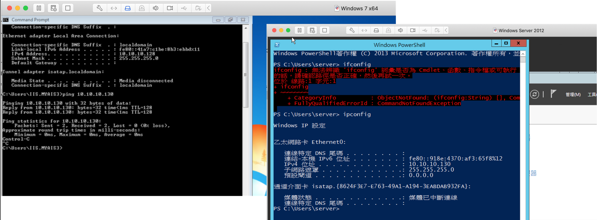
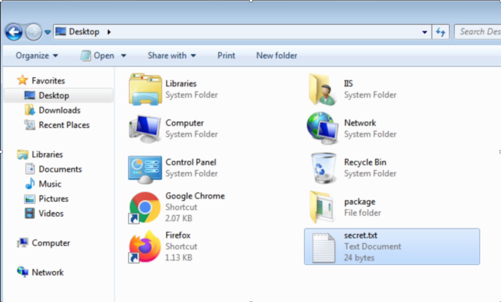
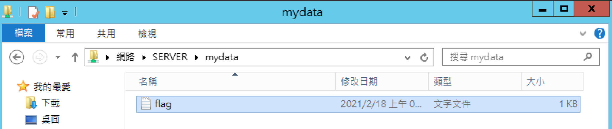
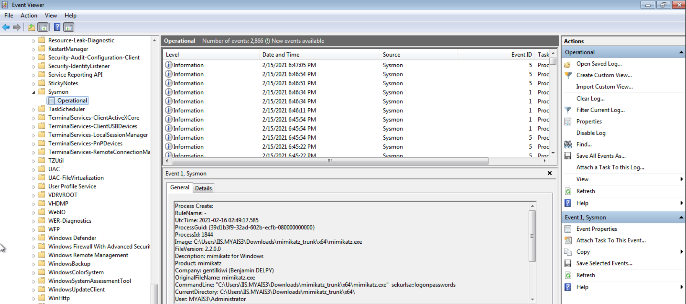

# Target Attack Analysis and Incident Response class

## Resource
- Slide: [download link](https://speakerdeck.com/will03/target-attack-and-incident-response)
- Virtul machine: [download link](https://drive.google.com/drive/folders/1403GOCwsX1SJAEwmPu3RMJzNj5_6A0Xv?usp=sharing)

## Training class
教育部資訊安全人才培育計畫&東華大學-東華資訊安全研究社 網路攻防暨逆向工程工作坊
Difficulty: Easy
## Introduction
After the training class, I put my resource here including
- slide
- Two crafted VM ( windows AD & IIS )
- README.md

Hope these can help someone who want to learn or teach about windows AD security.

### Environment setting
1. Download the two vm (link is on the top)
2. Import .vmdk to your vmware or virtual box
3. Create a host-only network with 10.10.10.0/24
4. Bind this network to both virtual machine
5. login to the windows server (pass: AIS3myadmin), and check the ip is `10.10.10.130`. If not, change it manually.
6. login to the windows 7 (pass:AIS3mylab), and check the network setting ( ip: `10.10.10.XXX` gw: `10.10.10.130` dns: `10.10.10.130` ). If not, change it manually with Admin password (in slide page 61).
7. Use win7 to `ping 10.10.10.130`

### Practice
LAB 0: Collection
- Find AD
- Find who you are
- Find all user in the domain

LAB 1: Privilege Escalation (local system)
- Try to get local system privilege
- Read the secret file (secret.txt) at Desktop

LAB 2: Privilege Escalation (Domain Admin)
- Try to get Domain administrator password
- Read the share file `\\mydata\flag.txt`

LAB 3: Let’s Hunting
- Use sysmon to find the footprint that your Privilege Escalation method in LAB 1 and 2

I put all the solution & detail in the slide.

### Summary
When making this training class resource, I realize that this topic is hard to design labs because of the environment setting is too complicated. So I leaved my VM and install step.
Hope everyone can learn it easily.

If you have any questions please feel free to contact me.

email: willll1616@gmail.com

## Reference
[內網安全攻防：滲透測試實戰指南](https://www.tenlong.com.tw/products/9787121377938)

